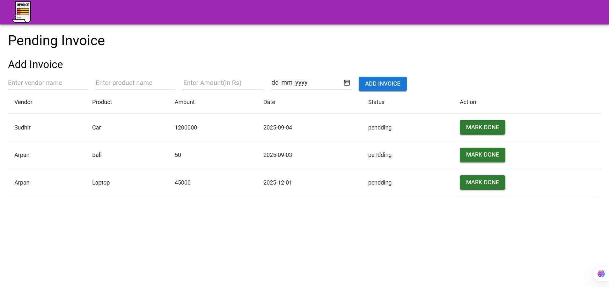

<h1 align="center" style="color: #2E8B57; font-size: 3rem;">
  Invoice management system Backend — Spring Boot
</h1>

  <strong>Backend service for managing invoices with Spring Boot, Spring Data JPA, and Hibernate.</strong>

  
  
  
  

---

<h2 style="color: #2E8B57; font-size: 2rem;">🚀 Features & Preview</h2>

<table>
  <tr>
    <td width="40%" valign="top">
      <h3 style="color: #2E8B57;">Key Functionality</h3>
      <ul>
        <li>✅ <strong>Add new invoices</strong> (Vendor, Product, Amount, Date)</li>
        <li>✅ <strong>Retrieve invoice list</strong> with status tracking</li>
        <li>✅ <strong>Mark invoice as done</strong> (Update status)</li>
        <li>✅ <strong>Delete invoice</strong> records</li>
        <li>✅ <strong>Input validation</strong> logic included</li>
      </ul>
    </td>
    <td width="60%">
      
    </td>
  </tr>
</table>

---

<h2 style="color: #2E8B57; font-size: 2rem;">🛠 Tech Stack</h2>

| Component | Technology |
| :--- | :--- |
| **Language** | Java 17+ |
| **Framework** | Spring Boot 3.2.4 |
| **ORM** | Hibernate |
| **Persistence** | Spring Data JPA |
| **Database** | MySQL |
| **Build Tool** | Maven |

---------

<h1 align="center" style="color: #2E8B57; font-size: 3rem;">
  Invoice management system — React
</h1>

  <strong>A responsive frontend dashboard for managing invoices, built with React and Material UI.</strong>

  
  
  

---

<h2 style="color: #2E8B57; font-size: 2rem;">🚀 Features & UI</h2>

<table>
  <tr>
    <td width="55%">
      
    </td>
    <td width="45%" valign="top">
      <h3 style="color: #2E8B57;">Dashboard Capabilities</h3>
      <ul>
        <li>✅ <strong>Add Invoices:</strong> Form inputs for Vendor, Product, Amount, and Date.</li>
        <li>✅ <strong>Date Picker:</strong> Integrated calendar input for accurate date selection.</li>
        <li>✅ <strong>Live Data Table:</strong> Displays fetched data from the Spring Boot API.</li>
        <li>✅ <strong>Status Management:</strong> "Mark Done" functionality to update invoice status.</li>
        <li>✅ <strong>Material UI:</strong> Professional styling using MUI components (Buttons, Grid, TextFields).</li>
      </ul>
    </td>
  </tr>
</table>

---

<h2 style="color: #2E8B57; font-size: 2rem;">🛠 Tech Stack</h2>

| Component | Technology | Usage |
| :--- | :--- | :--- |
| **Library** | React.js | Component-based UI architecture |
| **Styling** | Material UI (MUI) | Pre-built components and responsive grid system |
| **HTTP Client** | Axios | Handling API requests (GET, POST, DELETE) |
| **State Management** | React Hooks | `useState` for form data, `useEffect` for data fetching |

